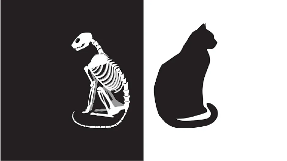

# Schrödinger's cat

Schrödinger's cat is a thought experiment used to illustrate a problem whereby observing a system you alter the state of the system. So how does this relate to programming? I found an intermittent bug in my code where if you try and debug it (observe it) the bug disappears. The bug only appears when you don't observe it. As you can imagine this can be very frustrating.

How can this even be possible? In what context does this happen? While I was on the brink of insanity, grappling with a bug that almost seemed like it had a personality, I realized I hadn't considered the asynchronous design of my code. This means that the code didn't run in a strictly linear execution path. This can lead to some very interesting bugs. 

In my case, dependencies were being resolved asynchronously and everytime I set a breakpoint the dependencies managed to resolve while on the breakpoint. This meant that the bug was never triggered since all dependencies had been resolved. This was all happening in a span of a few milliseconds so the debugger was fixing my bug consistently, and it had me believe one had something to do with the debugger :) but, as we know, correlation does not imply causation.

It took me a while, a whole day! to realize this.

