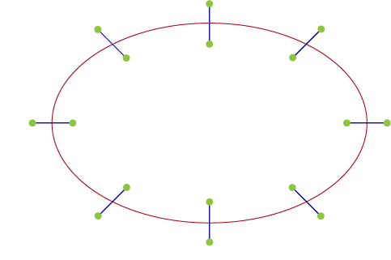

# Track Generator

I was recently working on training a self-driving car using Reinforcement Learning in Unity via [ml-agents](https://github.com/Unity-Technologies/ml-agents). When training AI in a simulated environment your AI is a good as your environment. So I made a Track Generator package that Procedurally Generates Closed Tracks from Voronoi Diagrams using C# Jobs System, Splines and Procedural Mesh Generation.

## How it Works

This package generates an array of vertices from a Voronoi Diagram and uses Unity's Spline package to generate a smooth closed path. This path is then procedurally generated into a Mesh.

### Voronoi Diagram

Voronoi Diagrams are a way to divide space into regions based on the distance to a set of points. It has many applications in game development such as procedural generation, pathfinding, and track generation.

I followed [this](https://gist.github.com/isedgar/d445248c9ff6c61cef44fc275cb2398f) algorithm to generate a Voronoi Diagram on a cartesian plane, it doesn't use Fortune's (sweeping line) algorithm, even though I should have, but it's simple and easy to understand. Alternatively you can follow the short 3-minute video [here](https://www.youtube.com/watch?v=I6Fen2Ac-1U).

### Vertices

To get the vertices for the track first you must select a set of adjacent cells from the Voronoi Diagram. Adjacency can be determined by comparing segments of the cells and if any two segments from each cell have a similar mid-point. Preferably you'll want to select interior cells that share all their sides with another cell.

Once you've a set of adjacent cells you now identify unique segments. Unique segments are segments with no adjacency with any segment in any other cell.

We now order the unique segments in a clockwise manner to get the vertices of the track.

### Spline

Generating Spline via Unity's spline package is as simple as adding the vertices to the spline and the spline will automatically generate a smooth path.

### Mesh

We generate a mesh by first segmenting the spline into a set of points based on the [resolution](https://github.com/rob1997/TrackGenerator?tab=readme-ov-file#configuration) of the track which acts as a divider for the spline. In the image below the spline has been divided into 8 segments with a resolution of 6.

we now extrude from each segment point one each side to get the vertices of the mesh. We do this by evaluating the position, tangent and up vector of the spline at a normalized distance of `t`.

UVs have a value of `float2(0, t)` at the right vertex and `float2(1, t)` at the left.

Once we get the vertices we now generate the triangles by connecting the previous vertex pair with the current vertex pair to form a quad.

Finally, we can generate a mesh by assigning the calculated vertices, UVs and triangles to the mesh and generate a track.

By increasing the [resolution](https://github.com/rob1997/TrackGenerator?tab=readme-ov-file#configuration) you can generate a smoother track.

## Performance

I used DOTS (Data-Oriented Technology Stack) to generate the voronoi diagram, vertices, splines and mesh. This allowed me to generate a track with 10 adjacent voronoi cells in less than 3 ms. The performance is quite good considering the complexity of the mesh generated.

You can find more data on performance of the package [here](https://github.com/rob1997/TrackGenerator/tree/main?tab=readme-ov-file#performance) and Voronoi Diagram generation [here](https://github.com/rob1997/TrackGenerator/tree/main?tab=readme-ov-file#performance).

---

If you would like to try out the package you can find it [here](https://github.com/rob1997/TrackGenerator). It's entirely open-source and free to use. If you have any improvements and/or optimizations to make [here](https://github.com/rob1997/TrackGenerator/tree/main?tab=readme-ov-file#contributing) is how you can contribute. I hope you find it useful and if you have any questions feel free to comment below :)

