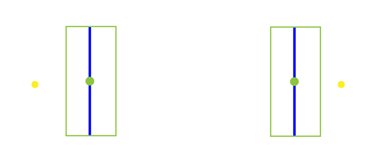
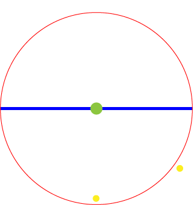
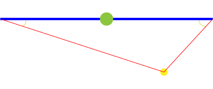
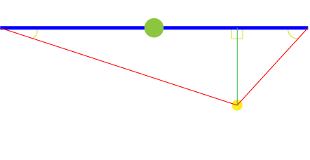
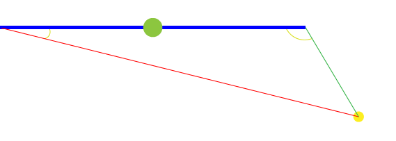
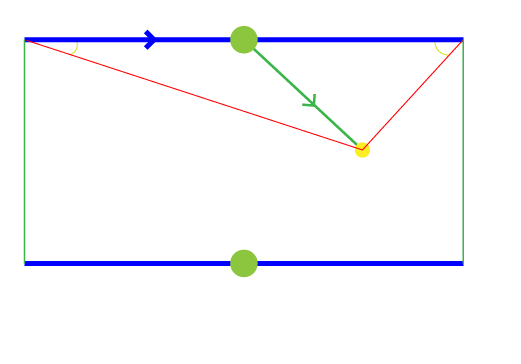
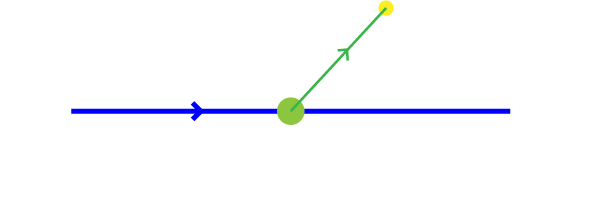

# Crossing Detection in Unity

I was recently working on training a self-driving Agent using Reinforcement Learning in Unity and the track I was using to train the Agent used checkpoints to determine the progress of the Agent. So I would need to detect when an Agent crosses a checkpoint.

This problem isn't unique to checkpoints, it can arise in any scenario that involves detecting a boundary crossing. It could be portals/gateways, area damage (for example when you step into fire) or hit detection.

## Approach

I tried several approaches before settling on the one that I thought to be the best. Below I'll list the approaches I tried and describe why they were not ideal.

### 1. Colliders

Duh! why not just use colliders with `Is Trigger` enabled. This way you can detect when an Agent enters the trigger via `OnTriggerEnter()` and when it exits via `OnTriggerExit()`. Not so fast, this approach actually worked pretty well except one major drawback! Physics triggers aren't checked every frame in Unity they're called during the physics update loop (at regular time intervals). This means that if the Agent is moving too fast the Physics loop will miss it. If our Agent can cover more distance than the colliders half-width in less time than a physics update loop interval then the collider will not detect it.

I found two possible ways to mitigate this. The first one is to decrease the physics update interval, so it can catch fast moving objects. This isn't viable since it will decrease performance, especially in physics intensive scenes. The second one is to use `Physics.OverlapBox()` in regular update loop but as you might have guessed this also decreases performance. Moreover, both methods still rely on speed, the only thing that changed is we would use the update loop instead of the physics loop.

I admit the eventuality/probability for this is pretty low, but I didn't like the limitation.

### 2. Distance (from checkpoint)

Obviously, why not just check the distance from the checkpoint's position and when it's below a certain value invoke the trigger, simple as that! Well not quite. Since the distance is measured from a point the proximity detection happens around a radius and this results in inconsistent results.

For example let's consider two Agents A1 and A2 moving towards a boundary.

We can see that A2 is clearly close to the boundary however because we're measuring distance from the checkpoint A1 will get past the boundary first.

### 3. Distance (from boundary)

In this approach we measure distance from the boundary segment as opposed to the checkpoint. The closest distance from a point to a line is always perpendicular to it, but we're dealing with a segment, not a line, as a boundary. First we have to determine if the point is in the bounds of the segment. We do this by first calculating the angle between the boundary segment and the line segment formed by connecting one end of the boundary to the position of the agent.

To check if the point is within the bounds of the segment we check if both angles are acute (< 90 degrees, in bounds) or if one of them is a right angle or an obtuse angle (>= 90 degrees, outside bounds). If both angles are acute we calculate the distance to boundary by getting the length from any one end of the boundary to the Agent then multiplying it by the sine of the corresponding angle.

However, if one of these angles is a right or an obtuse angle then we simply measure the distance between the corresponding end and the position of the Agent.

Now that we've the closest distance we simpy compare it to the specific proximity range value to detect crossing! This method is an improvement on the previous one but as you might have guessed it's also not "perfect". The main issue I had with it is that we're not actually detecting a crossing but measuring proximity to a boundary instead. So we invoke a crossing without actually, literally, crossing a boundary but by getting close enough to it.

### 4. Comparing to previous Frame

Okay, here we go, the final solution! As you might have already guessed from the title this solution involves caching values from the previous frame and comparing it to current frame values. If a point was within bounds of the boundary in a previous frame and is now, in the current frame, on the other side of the boundary then a crossing happened.

First we check if an Agent is in bounds by getting those two angles from the previous approach and checking if both are acute, next we get the direction from the checkpoint's position towards the Agent's position and check if it's cross product with the boundary's direction has a negative y value, we do this to check if the Agent is on the right side of the boundary. If all conditions are true then the Agent is in bounds, and we cache `_isInBounds` for the next frame.

In the next frame we check `_isInBounds`, if it's false then we check if it's in bounds this, current, frame and move on, but if it's true then we check which side of the boundary the Agent is now on. We do this by again checking if `(boundary x direction).y > 0`.

For most use-cases colliders are enough and this is overkill but if you're looking for a universal solution that'll work for any scenario I hope this helps. If you've any thoughts, please leave it in the comments below :)

