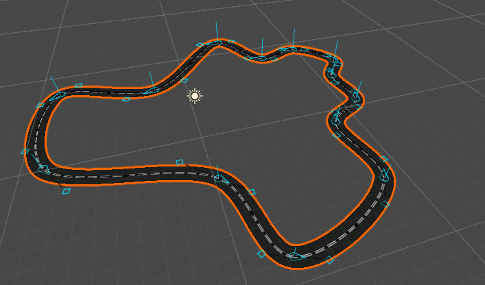
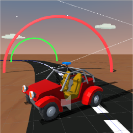
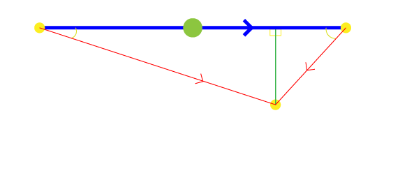
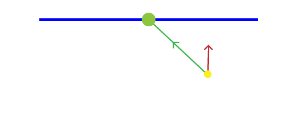
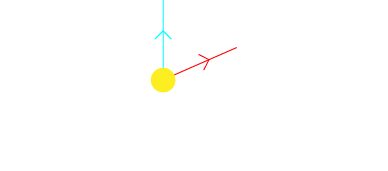
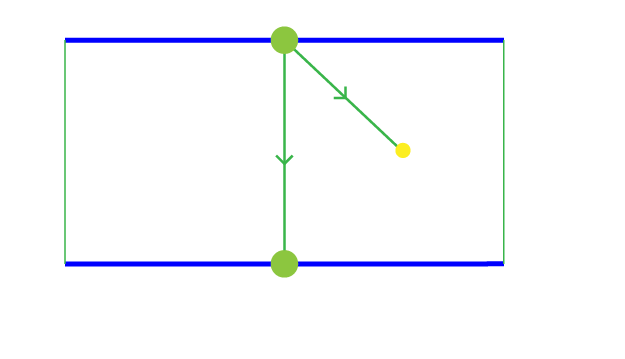
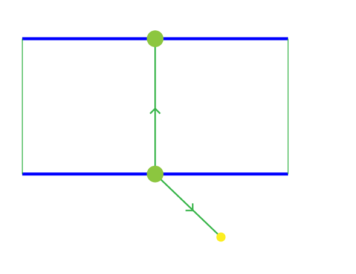
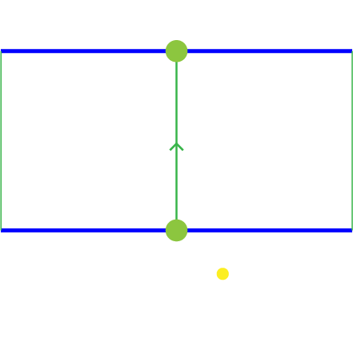

# Kart AI

<a href="https://github.com/rob1997/kart-ai/"></a>

In the age of ChatGPT and Gemini, I wanted to experiment with AI's application in Gaming. I experimented with Unity's [ML-Agents](https://unity-technologies.github.io/ml-agents/) a few years ago and I hadn't seen any practical use for it, but a lot has changed since then so I thought I could give it another go. The problem, train a self-driving Kart Agent that'll beat real people in a race around a track.

Useful References:
- [ML-Agents](https://unity-technologies.github.io/ml-agents/ML-Agents-Overview/)
- [Machine Learning](https://unity-technologies.github.io/ml-agents/Background-Machine-Learning/)
- [Unity](https://unity-technologies.github.io/ml-agents/Background-Unity/)

## Demo

<iframe src="https://rob1997.github.io/kart-ai/" title="Demo" width="75%"></iframe>

## Environment

An AI is as good as the environment it's trained on. It must be randomized enough to generalize well but not too random to be unpredictable. For a racing game, the environment consists of a track with checkpoints. This track has to be generated procedurally to ensure that the AI doesn't memorize the track but instead learns to drive. We'll also need to randomize the distance between checkpoints.

For this purpose, I made a [Track Generator](https://github.com/rob1997/TrackGenerator) that can output random procedural tracks using Voronoi Diagrams. The track is generated as a closed path and provides an array of checkpoints.



If you would like to know how I made the Track Generator I've an entry on it [here](log-2.md).

## Agent



Our Agent is a Kart that can accelerate, steer and brake. It has a `Motor.cs` script attached to it, which is controlled by `Driver.cs`, also attached to the Kart, which implements Ml-Agent's `Agent` class.

Actions are the decisions an Agent can make. In this case, the Agent can control the Kart's acceleration (gas), steering, and braking. Each of these actions are represented as non-discrete (continuous) normalized values. acceleration and steer can have values between -1 and 1 with -1 being full reverse/left and 1 being full forward/right. Braking is a discrete action with 0 as not braking and 1 as applying brakes. These values are then passed on from `Driver` onto `Motor` to control the Kart.

## Observations

Observations are inputs that the AI model uses to make decisions, during training or inference. We make a total of 13 observations, two of which are `float3` (a group of 3 observations).

- **Proximity:** How close the Agent is to the Boundary of the Target (next checkpoint) at a given Academy Step.



- **Target (Next Checkpoint):** Local Position of the Next Checkpoint measured from (relative to) the Agent's position.

- **Velocity:** Velocity of the Agent.

- **Movement Direction:** The movement direction of the Agent relative to the target. If Agent is moving directly towards the target this value is 1, if it's moving away it's -1.



- **Look Direction:** The movement direction of the Agent relative to itself (forward or reverse). If the Agent is moving forward this value is 1, if it's moving in reverse it's -1.



- **Distance From Track:** This value is the difference (dot product) between the direction from the target towards the Agent and the direction from the target towards the previous target. This is equivalent (directly proportional) to the distance from the mid of the road. So the further the Agent is from the mid of the road the lesser this value.



- **Next Turn:** The direction of the next turn (left or right) relative to the Agent's velocity. It has a value of -1 to 1 with 1 being the turn is 180 degrees to the left and -1 being 180 degrees to the right. This is important to anticipate an upcoming turn.



- **Next Distance:** The distance between checkpoints for the next target and current one. This is important to anticipate an upcoming turn.



- **Speed:** The magnitude of the Agent's velocity.

## Rewards

In Reinforcement Learning Agents need a reward (positive reinforcement) to encourage a certain behaviour or a punishment (negative reinforcement) to discourage it during training (learning). I used only positive reinforcement for this scenario. I had five reward signals working together to train the Agent.

### Change in Proximity
This value is the difference of proximity to the target (next checkpoint) between the previous academy step and the current. So if the Agent gets closer to the target this value is positive and if it gets farther it's negative. This reward signal is used to reward the Agent for getting closer towards the target's boundary.

We then multiply this value by a reverse normalized value of the distance between the current and previous targets (checkpoints), 1 being closest to the target/checkpoint without passing it and 0 being farthest or >= the distance between checkpoints. This gives even more increased rewards as you get closer to the target and vice versa.

```csharp
float distanceBetweenCheckpoints = math.distance(previousTarget, Target);

// 0 - 1 value, increases as you get closer to the target, 0 being the farthest (proximity == distance between checkpoints)
float proximityFactor = (distanceBetweenCheckpoints - math.clamp(_proximity, 0f, distanceBetweenCheckpoints)) / distanceBetweenCheckpoints;

// Higher reward as you get closer to the target
reward += math.max(0f, changeInProximity * proximityFactor);
```

### Distance from Track
This reward signal is used to reward the Agent for staying on the track. This value is also an [Observation](#observations).

```csharp
float3 directionToAgent = (float3) AgentPosition - Target;
            
float3 roadDirection = PreviousTarget - Target;

float distanceFromTrack = math.dot(directionToAgent.Normalize(), roadDirection.Normalize());
```

The value is clamped between 0 and 1 then multiplied by the already accumulated reward for this academy step.

```csharp
// the further the distance from the mid of the road the less reward
reward += reward * math.clamp(distanceFromTrack, 0, 1);
```

### Looking Direction
This reward encourages the Agent to move forward more than in reverse. This value is also an [Observation](#observations). The value is clamped between 0 and 1 then multiplied by the already accumulated reward for this academy step.

```csharp
reward += reward * math.clamp(lookDirection, 0, 1);
```

### Speed Factor
This value is the magnitude of the Agent's velocity moving towards the target. First we'll have to get the movement direction of the Agent relative to the target. Then we multiply that value by the speed (Velocity's magnitude) of the Agent and divide it, to normalize the value, by the maximum speed the Agent can go.

```csharp
// higher reward for faster velocity moving towards target
float speedFactor = (math.max(0, MovementDirection()) * Speed) / MaxSpeed;
```

This value is then clamped between 0 and 1 then multiplied by the already accumulated reward for this academy step. This reward encourages the Agent to move faster on the track.

```csharp
reward += reward * math.clamp(speedFactor, 0, 1);
```

### Passing Checkpoint
We give a reward of 1 when the Agent passes a checkpoint. A more detailed explanation of how we detect a checkpoint crossing can be found [here](log-3.md).

## Training

In the Training scene there's a total of 16 environments, each with a single Agent, training simultaneously. Each of these environments has a varied number of checkpoints by a factor of 3 (3 - 48) to simulate a more varied distance between checkpoints.

I ran a total of 11 training trials to optimize my training process and some of the things I've learned during that process are:

Positive reinforcement over negative reinforcement, at least for this scenario, works better. I tried using some negative reinforcement to punish unwanted behaviour, but it resulted in a very "scared" (less curious) Agent. It inhibited a desired behaviour out of "fear" for punishment.

Start with the most minimal observations and reward signals then increment your way up with more observations and reward signals. Then log and compare results. 

Geometric triggers over physics ones, since in a Game Scene the transform of every object is known, instead of using Colliders and RayCasts as triggers and observations it's better to use Geometric ones where possible. This will result in a higher Cumulative Reward but also a more stable training process. I've a more expanded entry on this [here](log-3.md).

I also experimented with Visual (Camera) Observations for training, but I lacked the computing power (time) to replicate the same results I had using Geometric Observations. I also tried Self-Play, but it proved to not fit our scenario because the Agents aren't truly "adversarial", stopping others from winning doesn't necessarily translate to a win for you. It also needed more computing power (time) so I couldn't iterate on it effectively.

Balancing between a varied (random) environment and a stable training was a challenge I hadn't considered. If an environment is too varied (random) the training becomes unstable and if it's too similar then the Agent won't be able to generalize, or works only in the environments it was trained on. I managed to balance this by varying the environment in a constant pattern that couldn't be recognized by the training process.

## Conclusion

Even though this ended in relative success my opinion is that I could've programmed a conventional game AI that did the same thing in a few days or less, it would also generalize a lot more. Maybe it's because I'm not as proficient in Reinforcement Learning or in ML-Agents as I'm in Conventional Game Programming, or maybe it's because this specific scenario for Game AI does not meet the requirements to use Reinforcement Learning, although I'm yet to find a use case where Reinforcement Learning is better suited than Conventional Game AI, but I'm still convinced that this is not a practical solution for most Game AI scenarios, at least not yet. If you've any comments or would like to share your findings feel free to comment below :) 

<script src="https://giscus.app/client.js"
        data-repo="rob1997/devlog"
        data-repo-id="R_kgDONZfyUg"
        data-category="Announcements"
        data-category-id="DIC_kwDONZfyUs4Ck-Na"
        data-mapping="pathname"
        data-strict="0"
        data-reactions-enabled="1"
        data-emit-metadata="0"
        data-input-position="top"
        data-theme="dark"
        data-lang="en"
        crossorigin="anonymous"
        async>
</script>