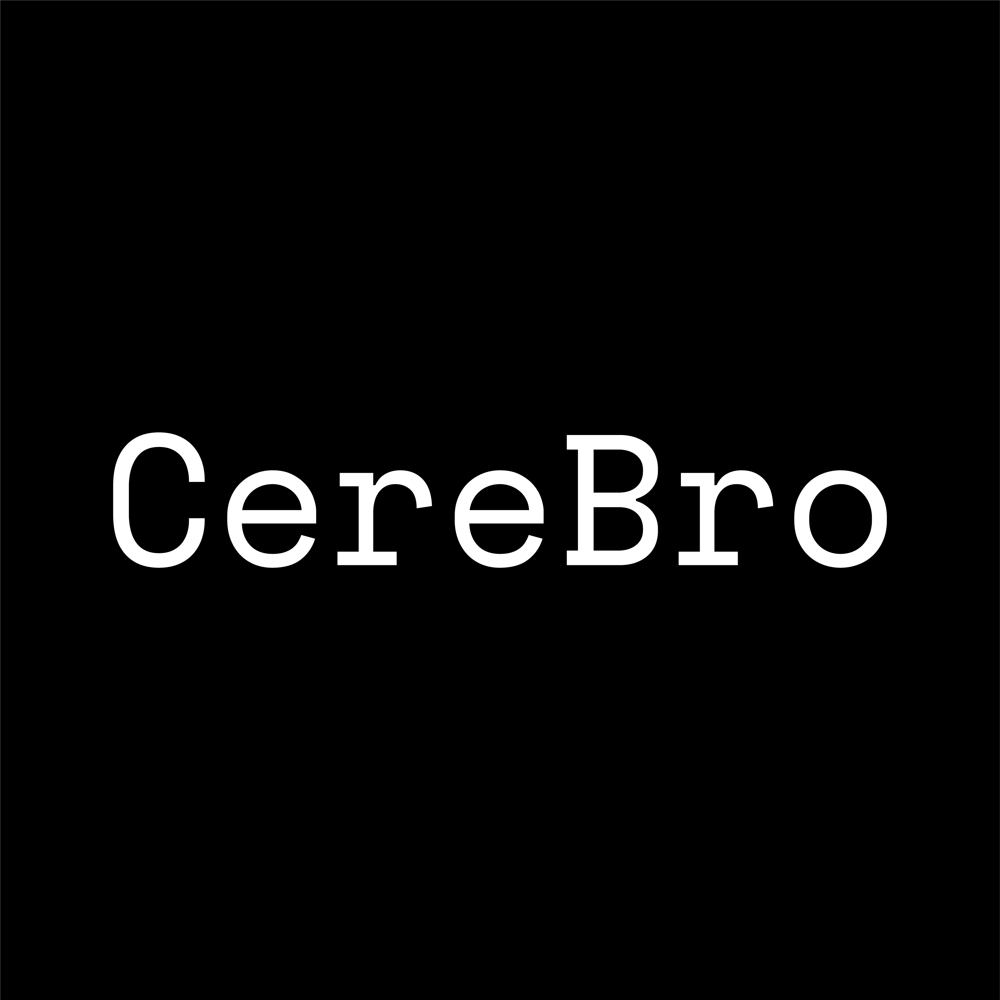
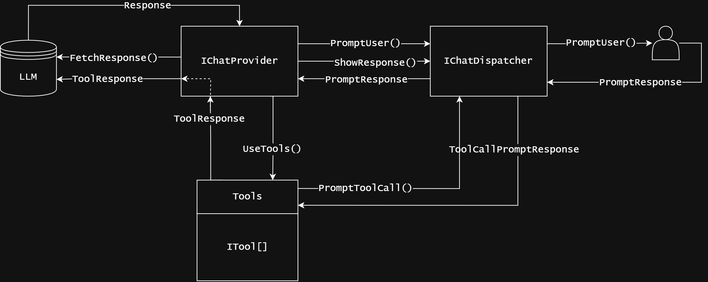

# CereBro

I recently had a change in my career path. I'm now working with tech stacks I've little to no experience in, and I found myself overwhelmed with the amount of information I had to learn in a short amount of time, so I heavily utilized (relied on 😅) AI to help me learn and complete my tasks. There's a lot of hype and noise in and around AI at the moment, and it's a very controversial topic among programmers, but I can honestly say it helped me a great deal, and I was very impressed by how much it actually contributed to my learning.

In fact, I was so impressed I took a detour to learn more about AI and that's how I learned about AI Agents, WOW! AI is the future, the near future! and I wanted to be a part of it, I thought of LLMs as brains that issue commands and Tools as limbs, and together they formed an AI Agent, and that's how I came up with CereBro.

CereBro is a model-agnostic AI Agent Wrapper for .Net that helps you write Tools that can be used with different AI models without changing the code.

## How it Works

For installation and usage instructions, you can check the [README](https://github.com/rob1997/CereBro?tab=readme-ov-file#cerebro). This section explains how CereBro works.

There's basically three components to CereBro:

- **IChatProvider:** This is the component that interacts with the AI model. It'll send the input to the model and fetches a response. You can implement this interface to use any AI model you want.
- **IChatDispatcher:** This is the component that handles the conversation. It'll take the prompt from the user and dispatch it to `IChatProvider` to be sent to the LLM for a response which will be dispatched to the user. You can implement this interface to use any chat interface you want. Currently, I only have a `ConsoleChatDispatcher`.
- **ITool:** This is an interface tools will have to implement. Tools are the limbs of the AI Agent, they're the ones that actually do the work. You can implement this interface to create your own tools.

This sort of resembles [Model Context Protocol (MCP)](https://modelcontextprotocol.io/), but it's not. As I was finishing this up MCP released an official [C# SDK](https://github.com/modelcontextprotocol/csharp-sdk) 🤦, I'll be looking into it to see if I can integrate it with CereBro.

## Conclusion

I'm very excited about this project and I can't wait to see what people do with it. I'm planning to add more models and tools to it, you can check out the backlog [here](https://github.com/rob1997/CereBro/issues). If you have any thoughts or suggestions, please leave them in the comments below :)

